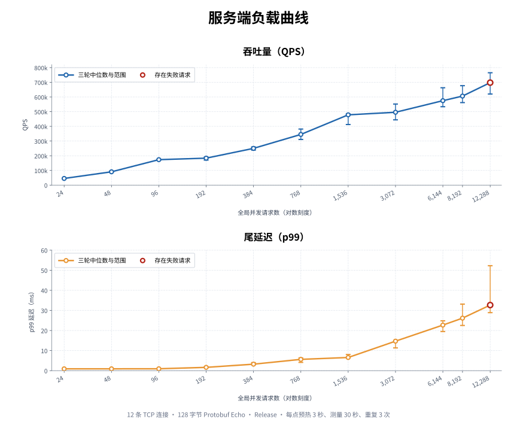

# xRPC

xRPC 是一个基于 `io_uring` 和 C++20 协程构建的 Linux RPC 框架。

项目采用 Linux 原生异步 I/O 驱动网络运行时，探索高并发 RPC 系统的网络传输与运行时设计。

## 核心特性

- **io_uring + C++20 协程**：基于 Linux 原生异步 I/O 构建服务端网络运行时，以协程组织连接的异步读写与生命周期。
- **多 I/O Loop 并发模型**：Accept 与连接 I/O 分离；每条连接建立后固定归属于一个 I/O Loop，由少量 I/O 线程驱动大量并发连接。
- **I/O 与业务执行分离**：Connection I/O Loop 专注网络收发与连接状态，业务 Handler 在独立 worker 线程执行，响应完成后回到原 I/O Loop 写回。
- **多路复用客户端**：多个同步 RPC 调用复用同一 TCP 连接，通过 request ID 独立匹配响应。
- **Consul 服务发现**：客户端通过 Consul 发现健康服务实例，调用时选择目标并复用连接。

## 架构

xRPC 将连接管理、网络 I/O 与 RPC 执行分离：客户端通过服务发现选择 Endpoint，服务端由独立 Accept Loop 接收连接，并将连接分配到多个 Connection I/O Loop。

一次 RPC 在所属 I/O Loop 中完成收包与解码，随后交由共享 Worker Pool 执行业务逻辑；响应编码完成后回到原 I/O Loop，并通过对应连接写回客户端。


## 快速开始

需要支持 `io_uring` 的 Linux、C++20 编译器、CMake 3.20+ 和 GNU Make；依赖源码已固定在 `third_party/`。

```bash
make
```

启动服务端：

```bash
./build/examples/xrpc_echo_server
```

另一个终端启动客户端：

```bash
./build/examples/xrpc_echo_client
```

最小 API 示例：

服务端：

```cpp
auto server_result = xrpc::RpcServer::Create();
if (!server_result.ok()) return 1;

auto server = std::move(server_result).value();
auto status = server.RegisterMethod<EchoRequest, EchoResponse>(
    "EchoService", "Echo", [](const EchoRequest &request) {
      EchoResponse response;
      response.set_message("echo: " + request.message());
      return response;
    });
if (status.ok()) status = server.Listen("127.0.0.1", 9000);
if (status.ok()) status = server.Run();
```

客户端：

```cpp
xrpc::RpcClientOptions options;
options.target_ = "list://127.0.0.1:9000";

auto client_result = xrpc::RpcClient::Create(options);
if (!client_result.ok()) return 1;

auto client = std::move(client_result).value();
auto response = client.Call<EchoResponse>("EchoService", "Echo", request);
if (!response.ok()) return 1;
```

## 性能

性能测试聚焦完整的服务端 Protobuf RPC 路径：连接接入、`io_uring` 收发、协议解析、Worker Pool 调度、Echo Handler 执行和响应写回。Firehose 仅作为低开销发压器，避免正式客户端先成为瓶颈。

测试运行于 WSL2（Ubuntu 24.04.3 LTS、Linux 6.6），CPU 为 Intel Core i7-9750H（6 核 12 线程），使用 Clang 20 进行 Release 构建，网络路径为本机 loopback。服务端使用 3 个 Connection I/O 线程和 3 个 Worker 线程；固定 12 条 TCP 连接和 128 字节 Echo payload，逐步提高全局并发请求数。每个工作点预热 3 秒、测量 30 秒并重复 3 次；图中圆点表示中位数，范围线表示三轮最小值到最大值。



- **低延迟**：96 个并发请求，QPS 中位数为 173,328，p99 中位数为 0.95 ms。
- **零失败容量**：8,192 个并发请求，QPS 中位数为 606,053，p99 中位数为 26.16 ms。
- **过载边界**：12,288 个并发请求超过服务端 10,000 个 RPC 的全局 Worker 准入上限，触发 `ResourceExhausted` 背压响应，三轮共出现 32,902 次失败。该点不作为有效容量成绩。

结果仅代表单机 loopback 环境，不用于推断跨主机性能或与其他 RPC 框架横向比较。完整数据、配置和复现命令见 [Benchmark 工具](tools/benchmark/README.md)。

## 项目边界

xRPC 当前面向 Linux，提供基于 TCP 的请求—响应式 RPC：每次调用对应一个请求和一个响应，支持 Protobuf 消息和原始字节载荷。

项目在 TCP 之上使用自定义 RPC 线协议（wire protocol），其中 metadata 和用户消息采用 Protobuf 编码。该协议不兼容 gRPC；TLS、身份认证、流式 RPC 和跨语言代码生成暂未提供。

## 文档

- [总体架构](docs/architecture.md)
- [I/O 运行时](docs/io-runtime.md)
- [服务端运行时](docs/server-runtime.md)
- [客户端运行时](docs/client-runtime.md)
- [线协议](docs/wire-protocol.md)
- [测试说明](tests/README.md)
- [Benchmark 工具](tools/benchmark/README.md)

## 许可证

xRPC 使用 [MIT 许可证](LICENSE)。仓库内引入的工具保留其自身许可证，详见[第三方声明](THIRD_PARTY_NOTICES.md)。
