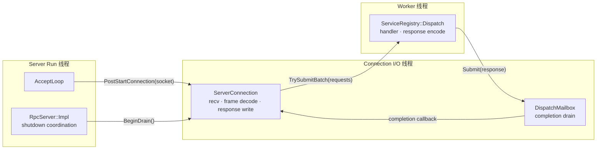

# XRPC 架构设计

## 设计目标

XRPC 是一个仅支持 Linux、基于 C++20 和 `io_uring` 构建的一元 RPC 框架。项目有意保持范围较小，集中展示四个容易审查的设计：

- 异步 I/O 负责 socket 和事件循环工作；
- 同步代码负责分帧、分发和用户 handler；
- 一条连接在同一时刻只有一个 I/O 所有者；
- 有界队列把过载转化为明确的状态码或连接关闭。

公开调用使用 Protobuf 类型消息，但 XRPC 线协议是私有协议，不兼容 gRPC。

## 请求生命周期

一次普通的类型化调用经过下面的路径：

```text
RpcClient::Call
  -> 端点选择与 request id 分配
  -> 多路复用 TCP 连接
  -> 服务端 Connection I/O 线程
  -> RpcFrameStream 增量分帧与解码
  -> Worker 线程
  -> 响应编码
  -> 原 Connection I/O 线程
  -> 客户端 reader 按 request id 匹配
  -> 等待中的调用者得到 StatusOr<Response>
```

最重要的边界是 I/O 外壳和同步核心之间的边界。Connection I/O 线程将完整的协议消息提交给 Worker 线程；handler 不在 Connection I/O 线程中执行。完成结果返回给连接所有者，由连接所有者保证响应顺序并串行化写操作。

## 服务端并发模型

`RpcServer` 是公开的 move-only facade，其 controller 拥有：

- Server Run 线程上的 accept `UringContext`；
- 一个或多个 `ConnectionIoLoop`，每个对应一个 Connection I/O 线程；
- 一个 `WorkerPool` 管理的 Worker 线程池；
- 类型化服务注册表；
- 可选的 Consul 注册器，注册实例时附带 TCP 健康检查；
- 资源和生命周期状态。

`AcceptLoop` 以 round-robin 方式分配新 socket。分配完成后，一条连接的 socket、读缓冲区、写队列和在途状态都由一个 Connection I/O 线程独占。这个所有权规则避免了全局 socket 锁。Worker 线程获得请求处理工作，但不接管连接本身；它们把响应工作返回给连接所有者。

## 线程模型与调用约束

服务端由三类执行线程组成：

- **Server Run 线程**：调用 `RpcServer::Run()` 的线程。它驱动 accept `UringContext`，接收新连接，将 socket 分配给 Connection I/O 线程，并协调 graceful shutdown；
- **Connection I/O 线程**：每个 `ConnectionIoLoop` 拥有一个。连接建立后固定归属其中一个线程，由该线程负责收包、分帧、连接状态和响应写回；
- **Worker 线程**：由 `WorkerPool` 管理。它执行 `ServiceRegistry::Dispatch()`、用户 handler 和响应编码，不直接操作 socket 或连接状态。

三类线程通过明确的交接点传递连接、请求和完成结果：



新连接和 shutdown 命令由 Server Run 线程投递；请求从 Connection I/O 线程进入 Worker 线程，处理结果通过 `DispatchMailbox` 回到原 Connection I/O 线程。Worker 线程不直接修改连接状态。

公开 API 遵守以下调用规则：

- `Listen()` 只准备本地监听 socket；`RegisterMethod()` 在 `Run()` 前均可调用；
- `Run()` 冻结方法注册，启动运行时并发布服务；
- `Run()` 只能由一个线程调用一次；
- `Stop()` 可以由其他线程调用，并且是幂等的；
- 多个线程可以并发调用同一个 `RpcClient`；
- `RpcServer` 和 `RpcClient` 的移动、析构不能与正在进行的调用并发；
- 用户 handler 可能在多个 Worker 线程上并发执行，业务状态由应用自行同步。

## 客户端并发模型

`RpcClient` 负责端点发现、端点健康状态、路由、request id 分配和可复用 transport。多个应用线程可以共享同一个 client 实例。

每个 transport 通过 request id 多路复用调用。reader 解码响应并唤醒对应的同步调用者。静态端点和 Consul 端点都会生成端点快照；sticky key 可以选择稳定端点，transport 错误会先更新端点状态，再影响下一次选择。

## 同步核心与异步外壳

同步核心包含不依赖事件循环也能理解的部分：

- frame header 和完整 frame 编解码；
- Protobuf 元数据和 payload 处理；
- 请求分发和服务查找；
- status 与 exception 映射；
- 用户 handler 执行。

异步外壳包含 `io_uring` 操作、socket 所有权、连接 loop、唤醒、定时器和关闭协调。外壳可以调用同步核心，但同步核心不会隐藏阻塞式的事件循环操作。

## 线协议

每个 frame 的布局是：

```text
24-byte frame header | protobuf metadata | opaque payload
```

frame header 是固定 24 字节的传输前缀，包含 magic、协议版本、消息类型、flags、metadata 大小、payload 大小和 request id。metadata 是 xRPC 自己的 Protobuf 消息：请求侧保存 service/method 路由信息，响应侧保存 RPC status。payload 是用户请求或响应消息序列化后的字节，协议层不会解释它。

frame header、metadata 和 payload 三个名称分别表示固定传输前缀、RPC 控制信息和用户消息，避免用 `header` 同时指代多个层次。metadata 和 payload 都有大小限制；无效的 magic、版本、长度或消息类型会转化为协议错误，而不是触发不受控的内存分配。

## 背压

服务端保护三类资源：

1. 每条连接允许的最大在途 handler job 数；
2. `WorkerPool` 允许的最大 pending job 数；
3. 每条连接允许排队的最大响应字节数。

请求容量耗尽时，只要协议仍允许返回响应，服务端就返回 `ResourceExhausted`。响应队列超过字节上限时，服务端关闭连接以释放内存。这些限制属于运行时行为，不只是 benchmark 参数。

## 失败与关闭

客户端 timeout、transport error 和协议 error 是不同的失败类别。尚未发送的请求可以在没有 wire response 的情况下完成；已经发送的请求则通过 request id 匹配响应。

服务端采用 graceful drain：`Stop()` 先关闭新请求的 admission 并停止 accept，已经进入 Worker 线程的 handler 继续执行，response 仍通过原 Connection I/O 线程写回。所有已接收请求完成后才停止 Connection I/O 线程和 Worker 线程，随后 `Run()` 返回。`Stop()` 是线程安全且幂等的；如果 handler 永远不返回，`Run()` 也会继续等待。

## 当前范围

当前实现支持 Linux、TCP、一元 RPC、类型化 Protobuf、raw payload、静态端点、可选 Consul 发现和有界服务端资源。当前不提供流式 RPC、TLS、认证、跨语言 stub 生成或稳定的 gRPC 线协议兼容性。
