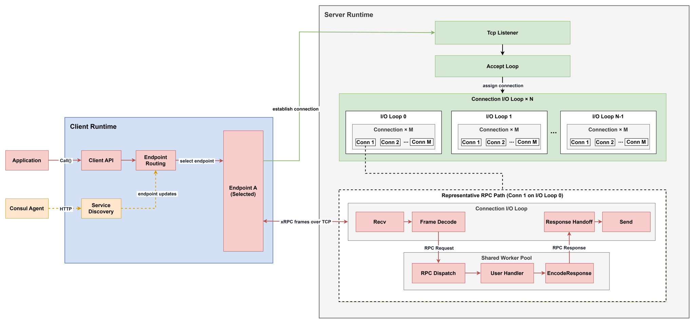
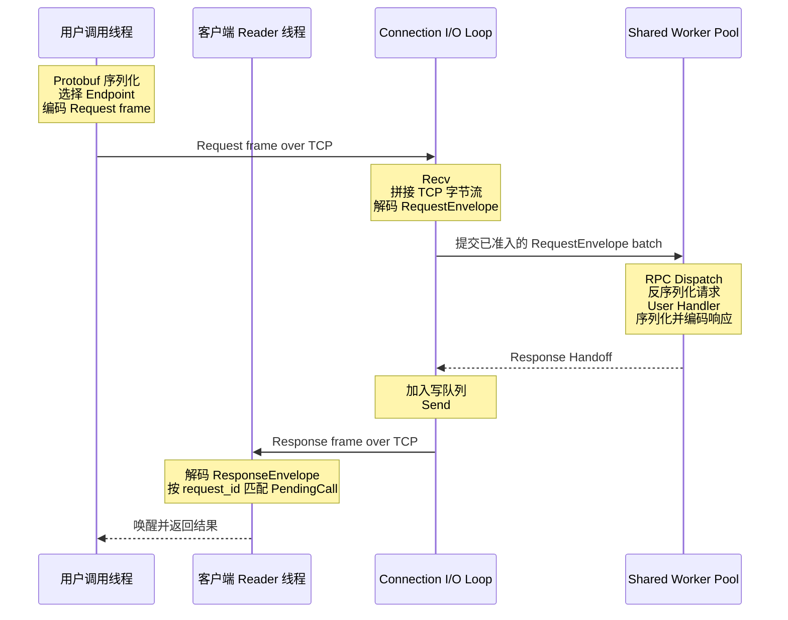

# xRPC 架构

## 项目定位

xRPC 是一个面向 Linux 的 C++20 RPC 工程实践项目，用于探索和验证高并发网络运行时的设计与实现。项目基于 TCP、`io_uring` 和自定义 RPC 线协议（wire protocol），其中 metadata 和用户消息采用 Protobuf 编码。它提供同步请求—响应 RPC，重点关注服务端网络 I/O、并发协作与有界资源控制。

项目不试图覆盖完整的 RPC 产品能力，而是围绕以下问题展开：

- 如何用 `io_uring` 和协程组织连接的异步读写，并保持连接归属和生命周期清晰；
- 如何划分 Accept、连接 I/O 和 Worker 执行域，完成明确的请求与响应交接；
- 如何通过有界准入和写队列控制过载，并在关闭时完成已接收请求；
- 如何让多个同步客户端调用复用连接，并完成 Endpoint 路由和安全 failover；
- 如何在 TCP 字节流上划分 RPC 消息，并关联请求、响应和 Protobuf payload。

## 总体结构



xRPC 由客户端和服务端两部分组成，两端通过基于 TCP 的 XRPC 线协议通信。客户端负责服务发现、Endpoint 路由和同步 RPC 调用，服务端负责连接接入、异步网络 I/O、业务执行和响应写回。

客户端采用同步网络模型，服务端使用 `io_uring` 和协程驱动网络 I/O。两端共享帧格式和请求—响应语义，但拥有各自独立的运行时。

### Client Runtime

- **Application**：发起 RPC 调用的用户代码。
- **Client API**：向应用提供同步 `Call()` 接口，接收请求并返回调用结果。
- **Service Discovery**：从 Consul 获取健康服务实例，并接收 Endpoint 更新。
- **Endpoint Routing**：根据当前 Endpoint 集合和路由策略选择目标实例。
- **Endpoint A (Selected)**：本次 RPC 最终选择的远端服务实例。

### Consul Agent

Consul Agent 位于 RPC 数据路径之外，保存服务实例及其健康状态。Service Discovery 通过 HTTP 查询 Consul，实际 RPC 请求不经过 Consul。

### Server Runtime

- **TCP Listener**：持有监听 socket，等待客户端建立连接。
- **Accept Loop**：异步接收新连接，并将连接分配给一个 Connection I/O Loop。
- **Connection I/O Loop × N**：组成服务端网络执行域，每个 I/O Loop 独立驱动一组固定归属的连接。
- **Connection × M**：表示固定归属于某个 I/O Loop 的客户端连接，负责请求接收和响应发送。
- **Shared Worker Pool**：由所有 Connection I/O Loop 共享，执行 RPC dispatch、用户 Handler 和响应编码。

### Representative RPC Path

图中的代表性路径展示了一次 RPC 在服务端的执行过程：

```text
Recv
→ Frame Decode
→ RPC Dispatch
→ User Handler
→ EncodeResponse
→ Response Handoff
→ Send
```

`Recv` 和 `Frame Decode` 在连接所属的 I/O Loop 执行；`RPC Dispatch`、`User Handler` 和 `EncodeResponse` 在 Shared Worker Pool 执行；`Response Handoff` 将编码后的响应交回原 I/O Loop，最后由 `Send` 通过原连接写回客户端。

## 核心边界

- 每条服务端连接建立后固定归属于一个 Connection I/O Loop，连接的可变网络状态只在所属 I/O 线程访问。
- Shared Worker Pool 不拥有连接，也不直接操作 socket；Worker 完成响应编码后，将结果交回请求原来所属的 I/O Loop。
- 客户端调用持有一次完整的路由视图；Endpoint 更新会发布新视图，但不会破坏仍在使用旧视图的调用。
- XRPC 线协议只定义帧格式和请求—响应语义，不参与连接调度或业务执行。

## 连接生命周期

```text
客户端选择 Endpoint
→ 按需建立 TCP 连接
→ 服务端 Accept Loop 接收连接
→ 分配给一个 Connection I/O Loop
→ 连接进入 Active
→ 承载一个或多个并发 RPC
→ 对端关闭或服务端发起 Stop
→ 完成已接收请求并关闭连接
```

客户端会复用同一 Endpoint 的连接；连接失效后，后续调用再按需建立新连接。服务端正常停止时不再读取新请求，并等待已接收请求完成、尽量写回响应；协议或 socket 错误则可以直接关闭连接。

## 一次 RPC 的完整路径

以下路径假设目标 Endpoint 已有可用连接。首次调用时，客户端会在发送请求前按需建立连接；连接关闭不是每次 RPC 的固定步骤。



请求可以在 Worker 线程中并发完成，因此响应不依赖请求到达顺序；客户端使用 `request_id` 完成多路复用匹配。

## 当前范围

当前实现支持 Linux、TCP、同步单次请求—响应调用、Protobuf 消息、原始字节载荷、静态 Endpoint、Consul 服务发现和有界服务端资源。

当前不提供流式 RPC、TLS、身份认证、异步客户端 API、跨语言 stub 生成，也不兼容 gRPC 线协议。

## 继续阅读

- [I/O 运行时](io-runtime.md)
- [服务端运行时](server-runtime.md)
- [客户端运行时](client-runtime.md)
- [线协议](wire-protocol.md)
