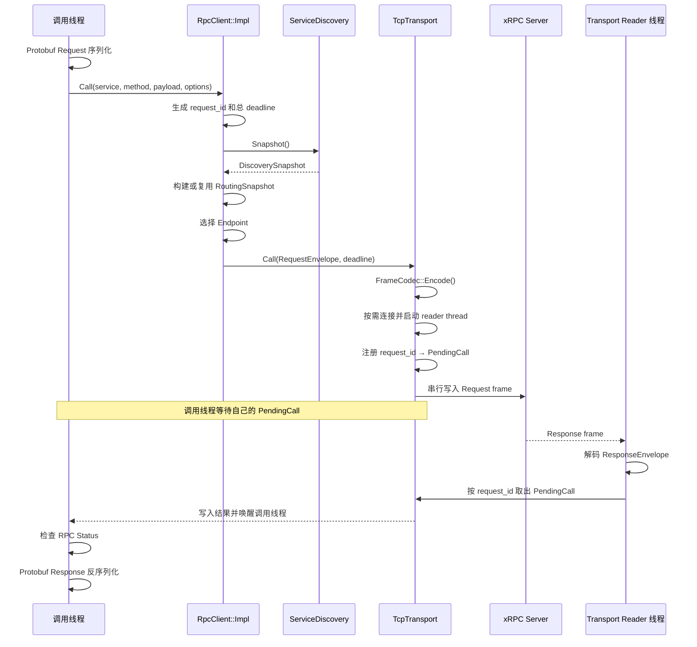

# 客户端运行时

xRPC 对外提供同步的一次请求—响应 API，但允许多个调用线程共享同一个 `RpcClient`。客户端需要在一次调用中完成服务发现、Endpoint 选择、连接复用和响应匹配，并且只在确认请求尚未发送时切换到其他 Endpoint。

当前客户端采用直接的阻塞式网络模型，不使用服务端的 `io_uring` 运行时：调用线程负责连接和发送，每个 Endpoint 的 `TcpTransport` 使用一条 reader thread 持续接收响应。

## 一次同步调用

下面的路径从用户发起调用开始，直到对应响应返回同一个调用线程：



发送和等待都发生在原调用线程，reader thread 只负责接收、解码和唤醒。客户端没有额外的 Worker Pool，也不会在 reader thread 执行用户代码。

## 服务发现与路由快照

创建客户端时，用户通过 `RpcClientOptions::target_` 指定“从哪里取得服务实例”。它采用带 scheme 的字符串，让静态地址和 Consul 服务名共用一个入口：

```cpp
xrpc::RpcClientOptions options;
options.target_ = "list://127.0.0.1:9000,127.0.0.1:9001";

auto client = xrpc::RpcClient::Create(options);
```

`RpcClient::Create()` 创建内部实现时，`MakeServiceDiscovery()` 根据 scheme 选择发现方式：

| `target_` 格式 | 含义 | Discovery 实现 |
| --- | --- | --- |
| `list://host:port,...` | Endpoint 直接写在配置中 | `StaticDiscovery` |
| `consul://service-name` | 从 `consul_address_` 指向的 Agent 查询该服务的健康实例 | `ConsulDiscovery` |

`StaticDiscovery` 在创建时解析、排序并去重固定地址，此后始终发布同一份 Endpoint 列表。`ConsulDiscovery` 将 scheme 后面的 `service-name` 用于 Consul 健康查询，并持续发布当前通过检查的实例。

这里的 `target_` 只决定 Endpoint 的来源。每次 RPC frame 中的 `service_name` 和 `method_name` 仍由 `Call()` 参数指定，用于服务端查找具体 Handler。

客户端使用两层不可变快照表达不同事实：

| 快照 | 表达的内容 |
| --- | --- |
| `DiscoverySnapshot` | 当前可用的 Endpoint 列表 |
| `RoutingSnapshot` | 同一版 Endpoint、对应的 `TcpTransport` 和一致性哈希环 |

`RpcClient::Impl::ResolveRoutingSnapshot()` 先取得 discovery snapshot。Endpoint 没有变化时直接复用已经发布的 routing snapshot；发生变化时，在 `routing_update_mutex_` 下完成以下更新：

```text
新的 DiscoverySnapshot
  ↓
复用仍然存在的 Endpoint 对应的 TcpTransport
  ↓
为新增 Endpoint 创建 TcpTransport
  ↓
重建一致性哈希环
  ↓
原子发布完整的 RoutingSnapshot
```

发布前，Endpoint、Transport 和哈希环已经形成一份完整视图。并发调用通过 `shared_ptr` 持有自己取得的快照，因此更新不会让一次调用看到新旧数据混合，也不会中途销毁它正在使用的 Transport。未发生变化的 Endpoint 会继续复用原有连接。

### Consul 变化如何到达客户端

Consul 不会主动向 xRPC 推送实例上下线通知。`ConsulDiscovery` 首先执行一次立即查询，随后由 refresh thread 使用 blocking query 等待变化：

```text
GET /v1/health/service/echo-service?passing=true&index=1234&wait=5s
```

健康实例集合发生变化时，请求会提前返回；没有变化时，最多等待 5 秒后返回，客户端随即发起下一次查询。响应头 `X-Consul-Index` 提供下一次请求使用的查询索引。

```text
实例注册、主动注销或健康检查状态变化
  ↓
Consul 更新健康查询结果和 index
  ↓
blocking query 返回
  ↓
解析全部 passing 实例
  ↓
原子发布新的 DiscoverySnapshot
  ↓
后续调用取得新的 RoutingSnapshot
```

正常注销和健康检查失败都会使 Endpoint 从新快照中消失。已经开始的调用仍可使用旧快照；变化只影响后续调用的路由。

Consul 暂时不可用时，refresh thread 保留上一份成功快照，并在 1 秒后重试。旧 Endpoint 此时可能已经失效，实际连接错误仍由 Transport 和 failover 规则处理。

## Endpoint 选择

Endpoint 的选择策略可以由单次调用的 `CallOptions` 调整。默认不提供路由 key，客户端使用 round-robin；需要让同一业务 key 优先访问同一实例时，可以设置 `sticky_key_`：

```cpp
xrpc::CallOptions options;
options.sticky_key_ = "user-42";

auto response = client.Call<EchoResponse>("EchoService", "Echo", request, options);
```

`sticky_key_` 只参与客户端路由，不会写入 Request frame，也不会传给服务端 Handler。

当 `sticky_key_` 为空时，客户端通过原子递增计数器轮换第一次尝试的 Endpoint：

```text
start = next_endpoint_index % endpoint_count
```

设置 `sticky_key_` 时，客户端在包含虚拟节点的一致性哈希环中选择起点。Endpoint 集合稳定时，相同 key 会得到相同的首选 Endpoint；集合变化时，只需重新映射部分 key。

两种策略选择的都只是本次调用首先尝试的 Endpoint，并不建立强制绑定。能否继续尝试其他 Endpoint，不由路由算法决定，而取决于上一次网络尝试是否可能已经发送请求。

## 一条连接如何承载多个并发调用

同一 Endpoint 的多次 RPC 不会重复建立 TCP 连接，而是复用其 `TcpTransport` 持有的长连接。多个调用还可以同时等待响应，这就是客户端的请求多路复用。

每次调用都有唯一的 `request_id`，并在发送前注册一个 `PendingCall`：

```text
调用线程 A                         request_id = 101
调用线程 B                         request_id = 102
调用线程 C                         request_id = 103
     │
     │ 注册 PendingCall
     ▼
┌─────────────────────────────────────────────┐
│ TcpTransport                                │
│                                             │
│ pending_calls                               │
│   101 → PendingCall A                       │
│   102 → PendingCall B                       │
│   103 → PendingCall C                       │
│                                             │
│ Request frames ──串行写入──▶ TCP connection │
└─────────────────────────────────────────────┘
                                │
                                ▼
                            xRPC Server

                            xRPC Server
                                │
                                ▼
┌─────────────────────────────────────────────┐
│ TcpTransport reader thread                  │
│                                             │
│ Response frame                              │
│   └─ request_id = 102                       │
│          ↓                                  │
│      pending_calls[102]                     │
│          ↓                                  │
│      唤醒调用线程 B                         │
└─────────────────────────────────────────────┘
```

Request frame 必须完整、串行地写入连接，避免不同调用的字节在 TCP 流中交错。接收侧只有一条 reader thread，它持续进行阻塞式 `recv`，增量解码 Response frame，并按 `request_id` 找回对应的 `PendingCall`。因此响应可以不按请求发送顺序返回，每个调用线程仍然只会收到自己的结果。

`PendingCall` 是 reader thread 与同步调用线程之间的完成通知：调用线程发送后等待，reader thread 写入响应或错误并唤醒它。socket 生命周期、frame 写入和 pending 表分别受到同步保护，但都服务于“一条连接、一个 reader、多个 PendingCall”这个基本模型。

`max_inflight_per_endpoint` 限制一条 Endpoint 连接上同时等待响应的调用数量。达到上限时，新请求尚未发送，因此客户端可以返回 `ResourceExhausted`，并按安全 failover 规则尝试其他 Endpoint。

## Timeout 与安全 failover

用户配置相对 timeout，客户端在调用开始时将其转换为一个绝对 deadline。连接、发送、等待响应以及可能的 Endpoint 切换共同消耗同一份时间预算：

```text
timeout
  ↓ now + timeout
deadline
  ├─ connect 使用剩余时间
  ├─ send 使用剩余时间
  ├─ PendingCall 等待到该时刻
  └─ failover 不会重置时间预算
```

失败后是否可以尝试下一个 Endpoint，由请求提交状态决定：

| 提交状态 | 含义 | Failover |
| --- | --- | --- |
| `NotSent` | 可以确认没有请求字节进入网络 | 可以尝试下一个 Endpoint |
| `MaybeSent` | 对端可能已经收到全部或部分请求 | 停止尝试，避免重复执行 |

连接建立失败、发送前 deadline 到期和单 Endpoint inflight 已满属于典型的 `NotSent`。一旦 `send()` 开始，后续发送错误、等待响应超时或 reader 观察到连接失败都属于 `MaybeSent`，因为客户端无法证明服务端没有执行请求。

这个规则不会自动重试可能已经发送的非幂等调用。它牺牲了一部分可用性，换取明确的重复执行边界。
