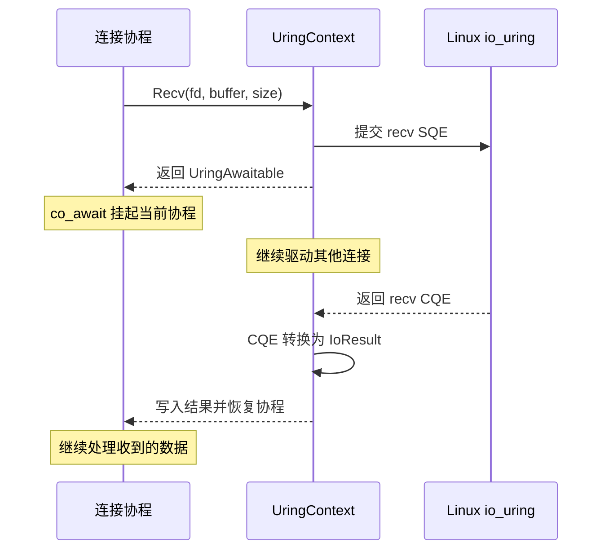
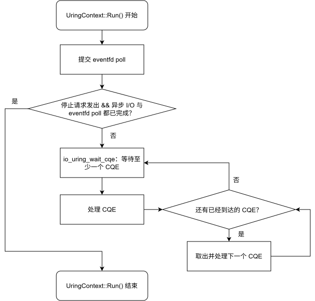

# I/O 运行时

## 核心模型

`UringContext` 是 xRPC 对 Linux io_uring 的底层运行时封装。它管理一个 io_uring ring 以及围绕该 ring 的事件循环，并向协程提供 `Accept()`、`Recv()`、`Send()` 和 `SleepFor()` 等异步操作。借助 C++20 协程，服务端可以把这套异步完成过程写成顺序代码；读取数据时，核心调用可以简化为：

```cpp
const io::IoResult result = co_await context.Recv(fd, buffer, size);
```

这里的 `context` 是当前连接所属 I/O 线程上的 `UringContext`。这行代码表示：通过该 `UringContext` 从 socket `fd` 异步读取最多 `size` 字节，并把数据写入 `buffer`。`Recv()` 创建并提交一次 io_uring read operation，返回一个 `UringAwaitable`；`co_await` 在操作尚未完成时挂起当前连接协程。内核完成读取后，运行时恢复该协程，表达式最终得到一个 `IoResult`，其中包含传输字节数或 I/O 错误。

它看起来像普通的同步调用：

```text
发起读取
→ 等到读取完成
→ 检查 result
→ 继续处理收到的数据
```

但等待期间不会阻塞 I/O 线程。同一个 `UringContext` 可以继续处理其他连接，直到当前读取的 CQE 到达。



`RpcServer::Run()` 所在线程驱动 Accept 使用的 `UringContext`；每个 Connection I/O Loop 则各自创建一个 I/O 线程和 `UringContext`，通过自己的 io_uring ring 驱动所属连接，并在 CQE 到达时恢复等待该操作的连接协程。

从使用方式看，它与 Asio 的 coroutine I/O 模型相似：异步操作通过 `co_await` 挂起，并由事件循环在完成事件到达后恢复。不同的是，xRPC 不提供通用异步框架，而是直接围绕 Linux `io_uring` 实现服务端需要的最小能力。

当前客户端仍使用阻塞式 transport，不经过这套运行时。客户端模型见[客户端运行时](client-runtime.md)。

## 事件循环与线程模型

`UringContext::Run()` 在调用线程中执行事件循环：它首先向 io_uring 提交用于跨线程唤醒的 eventfd poll，然后等待 CQE；每次至少取得一个 CQE，再批量处理当前已经到达的其他 CQE。停止请求发出，并且所有普通异步 I/O 与这个 eventfd poll 都完成后，`Run()` 才返回。

<p align="center">
  
</p>

`UringContext` 不是进程级的全局对象，服务端会按职责创建多个实例：

| 事件循环 | `Run()` 所在线程 | 负责的 I/O |
| --- | --- | --- |
| Accept context | `RpcServer::Run()` 的调用线程 | 监听 socket 的异步 Accept |
| Connection context | 每个 Connection I/O Loop 自己的 `std::jthread` | 该 Loop 所属连接的 Recv、Send 和取消 |

这里的“单线程”不表示 I/O 串行执行。一个 ring 中可以同时存在多条连接的 pending operation；线程提交操作后继续处理其他连接，内核完成某项 I/O 时再通过 CQE 通知它。

`Accept()`、`Recv()`、`Send()`、`SleepFor()` 和 `CancelFd()` 只能由对应 `UringContext::Run()` 的线程调用。这样，ring 的操作状态以及上层连接的可变 I/O 状态都可以遵守线程封闭，不需要在每次读写周围加锁。

`Post()` 和 `RequestStop()` 是跨线程控制入口。其他线程不能直接提交 socket I/O，而是通过 `Post()` 把工作交给 context 线程；`RequestStop()` 只负责发出停止请求。跨线程入口负责传递命令，不会改变连接状态仍由所属 I/O 线程维护这一约束。

## 协程如何等待 I/O

当前生产代码中只有三个协程函数，并且都运行在服务端 I/O 路径：

| 协程函数 | 等待的 I/O | 职责 |
| --- | --- | --- |
| `RpcServer::Impl::AcceptLoop()` | `Accept()` | 持续接收新 TCP 连接 |
| `ServerConnection::ReadLoop()` | `Recv()` | 读取并解析一条连接上的请求字节流 |
| `ServerConnection::WriteLoop()` | `Send()` | 按顺序发送该连接写队列中的响应 |

三者都返回 `Task<void>`。当前客户端不使用协程，生产路径也没有其他返回 `Task` 的函数。下面是连接读协程的简化结构：

```cpp
auto ServerConnection::ReadLoop() -> runtime::Task<void> {
  while (...) {
    const io::IoResult result =
        co_await context_->Recv(fd, buffer, size);

    // 解码并处理收到的数据
  }
}
```

调用协程函数时，编译器会创建 coroutine frame，用来保存局部变量、当前执行位置和 promise。`Task<void>` 持有这个 frame 的 coroutine handle；xRPC 的 `Task` 初始处于挂起状态，由所属 runtime 通过 `Start()` 启动。

执行到 `co_await UringAwaitable` 时，可以把编译器协议简化为三个步骤。这里的三个 `await_*` 是 `UringAwaitable` 提供给编译器的 awaiter 接口，不是另外三个协程函数：

| 方法 | 作用 |
| --- | --- |
| `await_ready()` | 检查 I/O 结果是否已经就绪 |
| `await_suspend(handle)` | 保存当前协程 handle，并在结果未就绪时挂起 |
| `await_resume()` | 协程恢复后返回 `IoResult` |

挂起只会保存连接协程的执行状态并把控制权交还给事件循环，不会阻塞 I/O 线程。该线程可以继续处理其他连接；对应 CQE 到达后，`UringContext` 写入 `IoResult` 并调用保存的 handle，连接协程随后从 `co_await` 之后继续执行。

## 内核操作与等待协程

协程挂起后，内核 operation 和等待它的 coroutine frame 具有不同的生命周期。本节说明 CQE 如何找到原协程，以及等待者提前销毁时如何避免访问失效状态。

一次普通异步 I/O 涉及四个内部对象：

```text
Task
└─ coroutine frame
   └─ UringAwaitable
      └─ shared_ptr<AwaitableState>
         ├─ IoResult
         └─ coroutine continuation

Operation
├─ 内核操作与 CQE completion 信息
└─ weak_ptr<AwaitableState>
```

`Accept()`、`Recv()`、`Send()` 和 `SleepFor()` 会创建 `Operation` 与 `AwaitableState`，准备 SQE 并立即提交，而不是等到 `await_suspend()` 才提交。因此 CQE 可能在协程真正挂起前到达，`AwaitableState` 会记录这一完成事实，使随后的 `co_await` 直接继续执行，避免丢失完成事件或重复恢复。

### 为什么 `Operation` 和 `AwaitableState` 分开

`Operation` 属于内核完成路径：提交后必须一直存在，直到对应 CQE 到达并由 `UringContext` 回收。

`AwaitableState` 属于协程等待路径：它只在等待者仍然存在时接收结果并保存 continuation。

二者的生命周期可能分叉，因此 `UringAwaitable` 通过 `shared_ptr` 持有 `AwaitableState`，`Operation` 只保存 `weak_ptr`。如果等待者提前销毁，内核操作和 `Operation` 仍可正常完成和回收，但 CQE 不会写入已经失效的状态，也不会恢复已经销毁的协程。

这层关系只保护 completion state，不拥有 `Recv()` / `Send()` 使用的 buffer，也不拥有 socket。上层必须保证 buffer 在 CQE 到达前有效，并负责协调 socket 的关闭与取消。服务端通过持有连接及其 Task，直到相关 I/O 完成或关闭流程结束，来满足这个条件。

## 不同类型的完成事件

运行时处理三类 completion：

| 类别 | 用途 | CQE 到达后的行为 |
| --- | --- | --- |
| Awaitable I/O | `Accept`、`Recv`、`Send`、`Timeout` | 生成 `IoResult` 并恢复等待协程 |
| Cancel | 取消指定 fd 上的 pending I/O | 校验取消结果，不恢复业务协程 |
| Wakeup | `eventfd` 唤醒事件循环 | 执行 posted callbacks 或推进停止流程 |

Cancel 和 Wakeup 是运行时控制操作，不会被强行包装成协程等待结果。这样，业务 I/O completion 和事件循环控制路径保持分离。

## 跨线程交接

`Post()` 是外部线程向 `UringContext` 交接工作的入口：

```text
其他线程
  │
  ├─ Post(callback)
  ├─ callback 进入受 mutex 保护的队列
  └─ write(eventfd)
         │
         ▼
io_uring poll CQE
  │
  ├─ 读取 eventfd
  ├─ 取出 callback batch
  └─ 在 I/O 线程执行 callback
```

服务端使用这条路径把新连接和 Worker 完成的响应交给对应 I/O 线程。`Post()` 只负责线程间交接，不会让接收回调的连接对象变成可由任意线程访问的对象。

当 `RequestStop()` 已经发起停止后，新的 `Post()` 不再进入 callback queue；停止前已经入队的回调仍会由 I/O 线程处理。

## 停止与取消

`RequestStop()` 表示“停止事件循环并排空已经提交的工作”，而不是立即销毁 ring：

```text
停止接受新的 Post
→ 唤醒 Run()
→ 执行已经入队的 callback
→ 取消 pending timeout
→ 继续处理剩余 CQE
→ 没有 pending I/O 和 wakeup poll
→ Run() 返回
```

`RequestStop()` 不会自动取消 pending `Accept`、`Recv` 或 `Send`。socket 的所有者必须让这些操作自然完成，或者关闭 fd 并在所属 I/O 线程调用 `CancelFd()`。取消请求本身也会产生 CQE，因此仍要由事件循环处理和回收。

这个约束保证 `UringContext` 不会在内核仍可能返回 CQE 时销毁相关状态。服务端关闭流程会先停止接收连接、关闭或排空连接 I/O，再让对应 `UringContext::Run()` 退出。

## Socket 边界

`io::Socket` 是文件描述符的 RAII 包装，负责 bind、listen、阻塞式 connect 和显式 close。它不拥有事件循环；服务端连接的异步收发由 `UringContext` 完成。

同步和异步发送路径都使用 `MSG_NOSIGNAL`。对端提前关闭连接时，发送操作会以 `EPIPE` 等普通 I/O 错误返回，而不会通过 `SIGPIPE` 终止整个进程。

## 设计边界

这套运行时刻意保持较小的职责范围：

- `UringContext` 只负责 I/O 提交、completion 和跨线程唤醒；
- `Task` 只负责 coroutine frame 的执行与结果；
- 连接所有权、buffer 生命周期和关闭顺序由上层 runtime 管理；
- RPC 帧解析、业务调度、服务发现和客户端路由不属于 I/O 层。

核心原则是让可变 I/O 状态归属于一个 event-loop 线程，并通过 SQE/CQE 和少数跨线程交接点驱动整个服务端网络路径。
