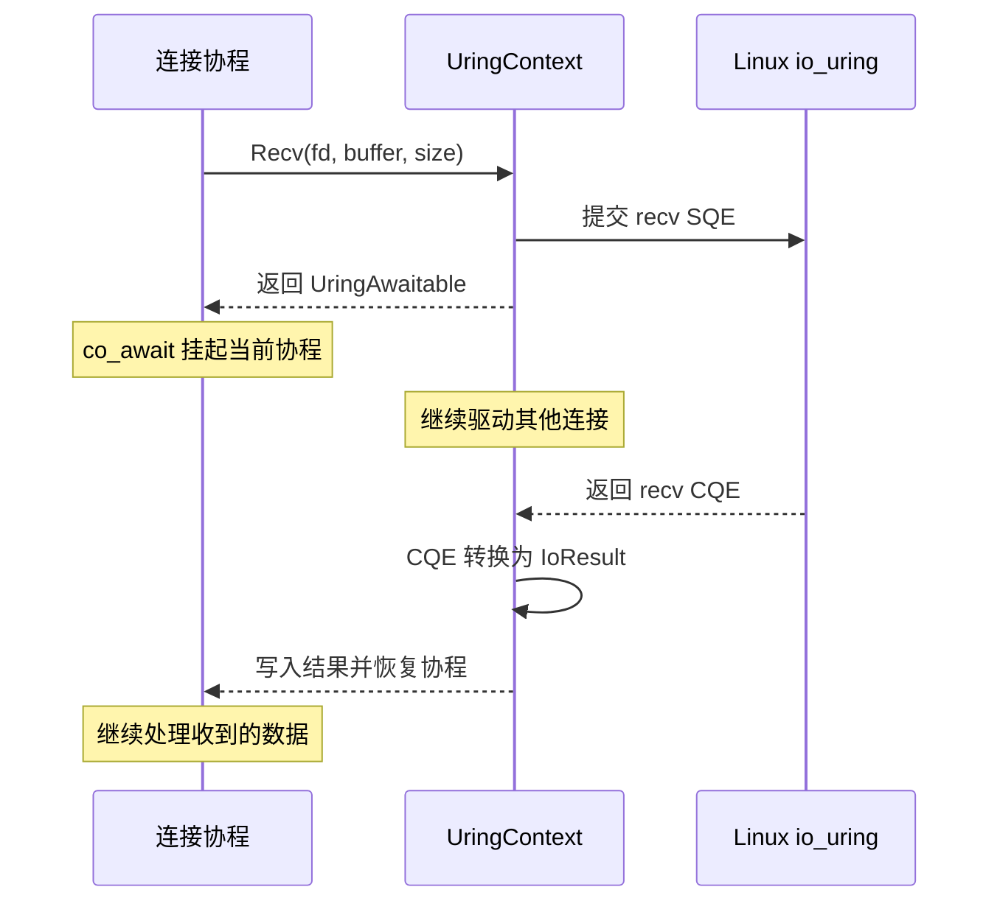
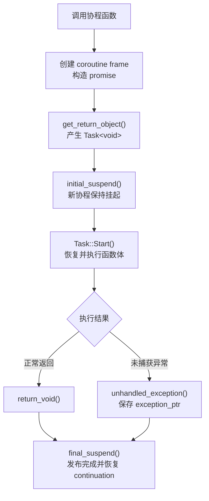
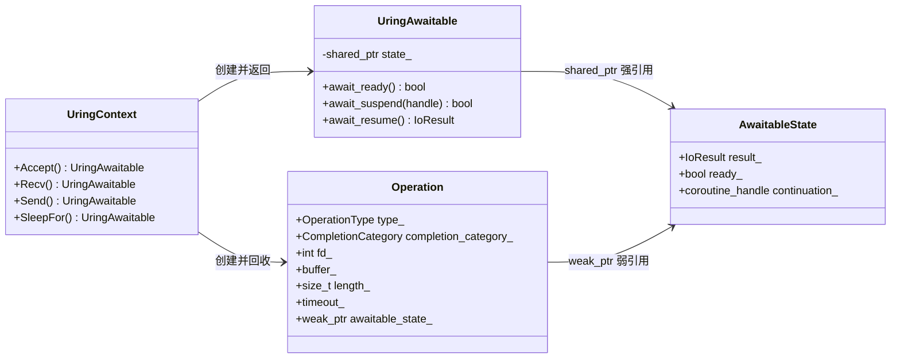
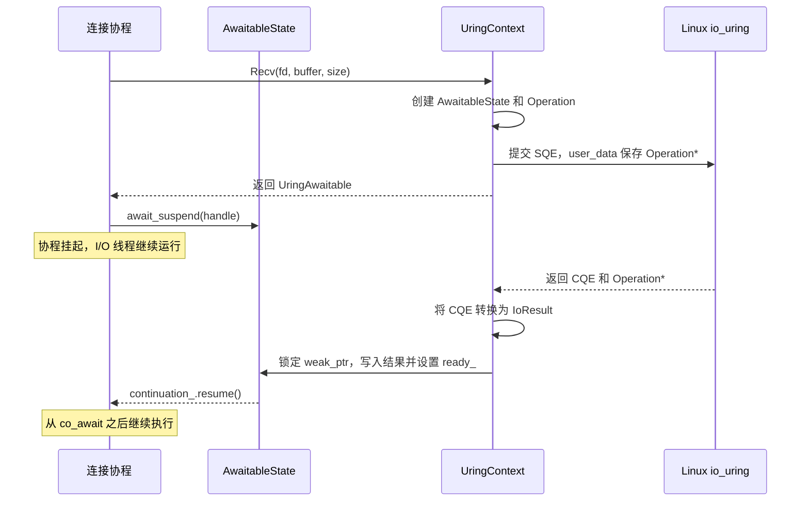

# I/O 运行时

## 核心模型

`UringContext` 是 xRPC 对 Linux io_uring 的底层运行时封装。它管理一个 io_uring ring 以及围绕该 ring 的事件循环，并向协程提供 `Accept()`、`Recv()`、`Send()` 和 `SleepFor()` 等异步操作。借助 C++20 协程，服务端可以把这套异步完成过程写成顺序代码；读取数据时，核心调用可以简化为：

```cpp
const io::IoResult result = co_await context.Recv(fd, buffer, size);
```

这里的 `context` 是当前连接所属 I/O 线程上的 `UringContext`。这行代码表示：通过该 `UringContext` 从 socket `fd` 异步读取最多 `size` 字节，并把数据写入 `buffer`。`Recv()` 创建并提交一次 io_uring read operation，返回一个 `UringAwaitable`；`co_await` 在操作尚未完成时挂起当前连接协程。内核完成读取后，运行时恢复该协程，表达式最终得到一个 `IoResult`，其中包含传输字节数或 I/O 错误。

它看起来像普通的同步调用：

```text
发起读取
→ 等到读取完成
→ 检查 result
→ 继续处理收到的数据
```

但等待期间不会阻塞 I/O 线程。同一个 `UringContext` 可以继续处理其他连接，直到当前读取的 CQE 到达。



`RpcServer::Run()` 所在线程驱动 Accept 使用的 `UringContext`；每个 Connection I/O Loop 则各自创建一个 I/O 线程和 `UringContext`，通过自己的 io_uring ring 驱动所属连接，并在 CQE 到达时恢复等待该操作的连接协程。

从使用方式看，它与 Asio 的 coroutine I/O 模型相似：异步操作通过 `co_await` 挂起，并由事件循环在完成事件到达后恢复。不同的是，xRPC 不提供通用异步框架，而是直接围绕 Linux `io_uring` 实现服务端需要的最小能力。

当前客户端仍使用阻塞式 transport，不经过这套运行时。客户端模型见[客户端运行时](client-runtime.md)。

## 事件循环与线程模型

`UringContext::Run()` 在调用线程中执行事件循环：它首先向 io_uring 提交用于跨线程唤醒的 eventfd poll，然后等待 CQE；每次至少取得一个 CQE，再批量处理当前已经到达的其他 CQE。停止请求发出，并且所有普通异步 I/O 与这个 eventfd poll 都完成后，`Run()` 才返回。

<p align="center">
  
</p>

`UringContext` 不是进程级的全局对象，服务端会按职责创建多个实例：

| 事件循环 | `Run()` 所在线程 | 负责的 I/O |
| --- | --- | --- |
| Accept context | `RpcServer::Run()` 的调用线程 | 监听 socket 的异步 Accept |
| Connection context | 每个 Connection I/O Loop 自己的 `std::jthread` | 该 Loop 所属连接的 Recv、Send 和取消 |

这里的“单线程”不表示 I/O 串行执行。一个 ring 中可以同时存在多条连接的 pending operation；线程提交操作后继续处理其他连接，内核完成某项 I/O 时再通过 CQE 通知它。

`Accept()`、`Recv()`、`Send()`、`SleepFor()` 和 `CancelFd()` 只能由对应 `UringContext::Run()` 的线程调用。这样，ring 的操作状态以及上层连接的可变 I/O 状态都可以遵守线程封闭，不需要在每次读写周围加锁。

`Post()` 和 `RequestStop()` 是跨线程控制入口。其他线程不能直接提交 socket I/O，而是通过 `Post()` 把工作交给 context 线程；`RequestStop()` 只负责发出停止请求。跨线程入口负责传递命令，不会改变连接状态仍由所属 I/O 线程维护这一约束。

## 协程如何等待 I/O

当前生产代码中只有三个协程函数，并且都运行在服务端 I/O 路径：

| 协程函数 | 等待的 I/O | 职责 |
| --- | --- | --- |
| `RpcServer::Impl::AcceptLoop()` | `Accept()` | 持续接收新 TCP 连接 |
| `ServerConnection::ReadLoop()` | `Recv()` | 读取并解析一条连接上的请求字节流 |
| `ServerConnection::WriteLoop()` | 写队列通知、`Send()` | 等待并按顺序发送该连接写队列中的响应 |

三者都返回 `Task<void>`。当前客户端不使用协程，生产路径也没有其他返回 `Task` 的函数。下面是连接读协程的简化结构：

```cpp
auto ServerConnection::ReadLoop() -> runtime::Task<void> {
  while (...) {
    const io::IoResult result =
        co_await context_->Recv(fd, buffer, size);

    // 解码并处理收到的数据
  }
}
```

调用协程函数时，编译器会把函数转换为状态机，并创建 coroutine frame，用来保存局部变量、当前执行位置和 promise。`Task<void>` 持有这个 frame 的 coroutine handle；xRPC 的 `Task` 初始处于挂起状态，由所属 runtime 通过 `Start()` 启动。

每条服务端连接固定拥有一条读协程和一条写协程。读协程通过 `Recv()` 等待内核网络输入；写协程在有数据时通过 `Send()` 等待 socket，在队列为空时通过一个单等待者 awaiter 等待用户态入队通知。两种等待都只挂起当前协程，不阻塞 Connection I/O 线程。

协程返回类型需要向编译器提供 `promise_type`。在 xRPC 中，`Task<void>::promise_type` 实际指向存放在 coroutine frame 内的 `TaskPromise<void>`。它参与整个协程从创建到结束的过程：



这些函数是 C++ 协程协议规定的 promise 钩子，编译器会在相应阶段调用它们：

| Promise 钩子 | 在 xRPC 中的作用 |
| --- | --- |
| `get_return_object()` | 创建持有 coroutine handle 的 `Task<void>` |
| `initial_suspend()` | 返回 `suspend_always`，让 Task 创建后先保持挂起 |
| `return_void()` | 处理协程正常执行到 `co_return` |
| `unhandled_exception()` | 保存未捕获异常，供 Task 的观察者重新抛出 |
| `final_suspend()` | 发布完成状态，并恢复等待该 Task 的 continuation |

这里的 coroutine promise 是 C++ 协程协议的一部分，与线程同步中常见的 `std::promise` 没有关系。它管理整个协程的生命周期；协程运行过程中遇到的每一次 `co_await`，则由对应的 awaiter 管理。

C++20 只定义协程的语言协议，不提供事件循环或网络运行时。编译器看到 `co_await expression` 时，会从表达式取得一个 awaiter，并按标准协议调用 `await_ready()`、`await_suspend()` 和 `await_resume()`。这些名称来自 C++ 协程协议，不是 xRPC 自行约定的接口。

一个类型可以通过 `operator co_await` 返回单独的 awaiter，也可以直接实现这三个方法。xRPC 采用后者：`UringContext::Recv()` 返回的 `UringAwaitable` 本身就是 awaiter。因此下面的代码：

```cpp
const io::IoResult result =
    co_await context_->Recv(fd, buffer, size);
```

可以近似理解为编译器生成了以下控制流程：

```cpp
UringAwaitable awaiter = context_->Recv(fd, buffer, size);

if (!awaiter.await_ready()) {
  // current_handle 由编译器从当前 coroutine frame 构造。
  const bool should_suspend = awaiter.await_suspend(current_handle);
  if (should_suspend) {
    // 挂起当前协程，并把控制权返回给调用方。
  }
}

const io::IoResult result = awaiter.await_resume();
```

这是便于理解的等价流程，不是编译器实际生成的完整 C++ 源码。`UringAwaitable` 的三个方法分别控制这一个 I/O 等待点：

| 方法 | 作用 |
| --- | --- |
| `await_ready()` | 检查 I/O 结果是否已经就绪 |
| `await_suspend(handle)` | 保存当前协程 handle，并在结果未就绪时挂起 |
| `await_resume()` | 协程恢复后返回 `IoResult` |

挂起只会保存连接协程的执行状态并把控制权交还给事件循环，不会阻塞 I/O 线程。该线程可以继续处理其他连接；对应 CQE 到达后，`UringContext` 写入 `IoResult` 并恢复保存的 handle，连接协程随后从 `co_await` 之后继续执行。

## I/O 完成后如何恢复协程

`co_await` 挂起协程后，Linux 只知道某个 io_uring operation 已经完成，并不知道对应哪个 C++ coroutine frame。`UringContext` 必须把 CQE 转换为 `IoResult`，找到等待该结果的 coroutine handle，并在 I/O 线程上恢复它。

### 完成状态设计

一次 awaitable I/O 使用两个状态对象：`AwaitableState` 服务协程等待侧，`Operation` 服务内核完成侧。下面的结构图只展示与 completion 生命周期有关的成员和关系：



`AwaitableState` 是协程侧的完成槽。它保存 CQE 转换得到的 `IoResult`、结果是否就绪，以及等待该结果的 coroutine handle。`UringAwaitable` 通过 `shared_ptr` 保证这份状态在等待期间有效。

`Operation` 是每个 SQE 对应的内核侧提交记录。它保存 operation 类型、completion 类别以及 fd、buffer、长度或 timeout 等提交信息，但只通过 `weak_ptr` 观察 `AwaitableState`，不会延长等待者的生命周期。

`Operation` 由 `UringContext` 创建。提交 SQE 时，它的指针被写入 `user_data`；CQE 到达后，`UringContext` 从同一个字段取回 `Operation`，并在处理完成后回收它。

### 正常完成路径

`UringContext::Recv()` 等接口会先创建 `AwaitableState` 和 `Operation`，再准备并提交 SQE。随后 `co_await` 将当前 coroutine handle 保存到 `AwaitableState`，等待 CQE 沿着 `Operation` 的弱引用返回结果。

完整的恢复路径如下：



### 边界时序

下面两种情况不是 I/O 错误，而是 awaitable 需要正确处理的生命周期顺序。

#### 结果先于协程挂起就绪

**情况：** 调用方可以先取得 `UringAwaitable`，稍后才执行 `co_await`；context 已经停止时，提交接口也会在返回 awaitable 前直接写入取消结果。因此协程准备挂起时，`IoResult` 可能已经就绪。

**行为：** `AwaitableState` 保存结果并将 `ready_` 设为 `true`。后续 `await_ready()` 返回 `true`，编译器跳过挂起步骤，直接通过 `await_resume()` 取得结果。

#### 等待者先于 I/O 结束

**情况：** `UringAwaitable` 或所属 coroutine frame 已经销毁，但提交给内核的 operation 仍然 pending。`AwaitableState` 随最后一个 `shared_ptr` 销毁，`Operation` 则继续等待对应 CQE。

**行为：** CQE 路径无法从 `weak_ptr` 锁定 `AwaitableState`，因此不会写入结果或恢复 coroutine handle，只处理并回收 `Operation`。这样可以避免访问已经销毁的 coroutine frame。

正常服务端路径会保留连接及其 Task，直到相关 I/O 完成或取消；这两个分支用于保证底层 awaitable 在边界顺序下仍然安全。

## CQE 的三种处理方式

`Operation::completion_category_` 将 CQE 分成三类，它区分的是“收到 CQE 后运行时要做什么”。

| 类别 | 来源 | CQE 到达后的行为 |
| --- | --- | --- |
| Awaitable I/O | `Accept`、`Recv`、`Send`、`SleepFor` | 转换为 `IoResult`，再恢复等待协程 |
| Cancel | `CancelFd()`、停止时取消 timeout | 确认取消请求，不直接恢复业务协程 |
| Wakeup | `eventfd` poll | 排空 eventfd 与 posted callback，或推进停止流程 |

Cancel CQE 只表示“取消请求已经被内核处理”。被取消的 `Accept`、`Recv` 或 `Send` 仍会各自产生 completion；原协程由那一条 I/O completion 恢复，而不是由 Cancel CQE 恢复。

Wakeup CQE 是 `Post()` 与 `RequestStop()` 的共同落点。正常运行时，`UringContext` 排空 eventfd 和 callback queue 后会重新提交 eventfd poll；已经请求停止时则不再重挂该 poll，并开始取消 pending timeout。

## 跨线程控制与停止

`Accept()`、`Recv()`、`Send()`、`SleepFor()` 与 `CancelFd()` 只能由 `UringContext::Run()` 所在线程调用。其他线程不能直接碰 socket I/O，只能通过 `Post()` 或 `RequestStop()` 发送控制命令。

### Post()

`Post()` 将 callback 放入 mutex 保护的队列。队列从空变为非空时，调用方写入 eventfd；已经挂起的 eventfd poll 因而产生 Wakeup CQE，最终由 I/O 线程取出并执行 callback：

```text
其他线程
  ↓
Post(callback)
  ↓
callback queue + eventfd write
  ↓
Wakeup CQE
  ↓
I/O 线程执行 callback
```

服务端通过这条路径把已接受 socket 交给 Connection I/O Loop，也把 Worker 经 `DispatchMailbox` 返回的 completion 交给原连接的 I/O 线程。交接的是工作，不是连接所有权；连接的可变状态仍只由所属 I/O 线程修改。

### 停止请求、I/O 取消与资源释放

`UringContext` 负责在给定 fd 上提交和完成异步 I/O，但不管理 socket 的生命周期。socket 由上层连接对象拥有，并由其决定何时关闭。

因此，运行时停止、pending I/O 取消和 fd 释放是三个独立问题：

| 接口                | 职责                                                         |
| ----------------- | ---------------------------------------------------------- |
| `RequestStop()`   | 请求 event loop 停止；`Run()` 会继续处理 CQE，直到所有已提交 operation 完成后返回 |
| `CancelFd(fd)`    | 取消指定 fd 上尚未完成的 I/O，使对应 operation 尽快产生 completion           |
| `Socket::Close()` | 关闭并释放 socket fd，由 socket owner 负责调用                        |

`RequestStop()` 不会直接终止 pending I/O。它只表达 `UringContext` 的停止意图，并通过 eventfd 唤醒 `Run()`。在停止请求发出后，`Run()` 仍会继续处理已有 CQE，直到 pending operation 归零后才返回。

`CancelFd(fd)` 也不会停止整个 context。它只针对指定 fd 提交取消操作。取消请求本身会产生 Cancel CQE，被取消的原始 I/O 也会产生自己的 CQE，因此这些 completion 仍需要由 `Run()` 正常处理，相关 operation 才能完成回收。

连接何时取消 I/O 和关闭 socket 属于上层连接生命周期策略。正常 shutdown 可以先停止接收新请求并排空已经接收的工作；发生连接错误或要求立即停止时，也可以直接终止连接。`UringContext` 不参与这些策略判断，只负责已提交 I/O 的执行、取消和 completion 处理。

因此：

* `RequestStop()` 管理 `UringContext` / event loop 的生命周期；
* `CancelFd(fd)` 管理指定 fd 上 pending I/O 的取消；
* `Socket::Close()` 管理 socket fd 的生命周期。

三者职责独立，由上层 runtime 在关闭流程中协调使用。

## 运行时约束

* 一个 `UringContext` 只由一条 `Run()` 线程驱动；同一个 ring 中可以同时存在多条 pending I/O。
* `Accept()`、`Recv()`、`Send()` 和 `SleepFor()` 等异步操作通过 `UringAwaitable` 与 `co_await` 挂起调用方；I/O 线程本身不执行阻塞式等待。
* `UringContext` 负责 SQE 提交、CQE 处理、协程恢复和跨线程唤醒；`Task` 负责 coroutine frame。
* 连接状态、RPC 帧解析、业务调度、服务发现和客户端路由属于上层 runtime，不属于 I/O 层。
