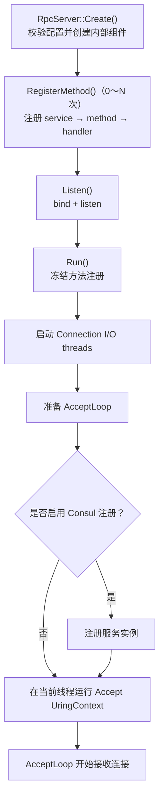
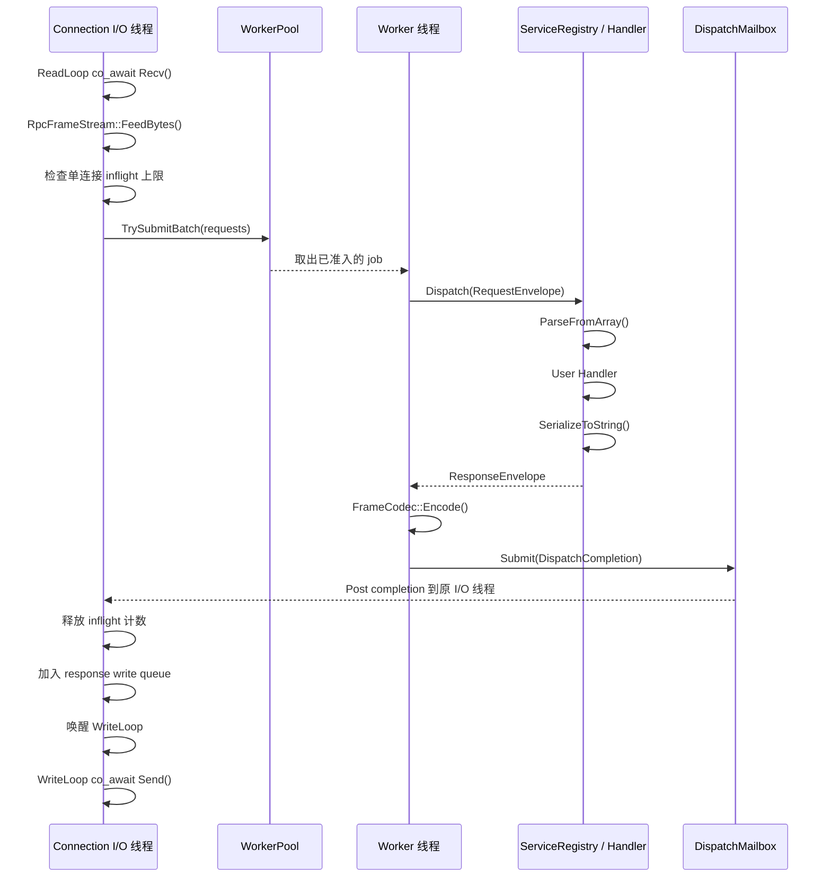
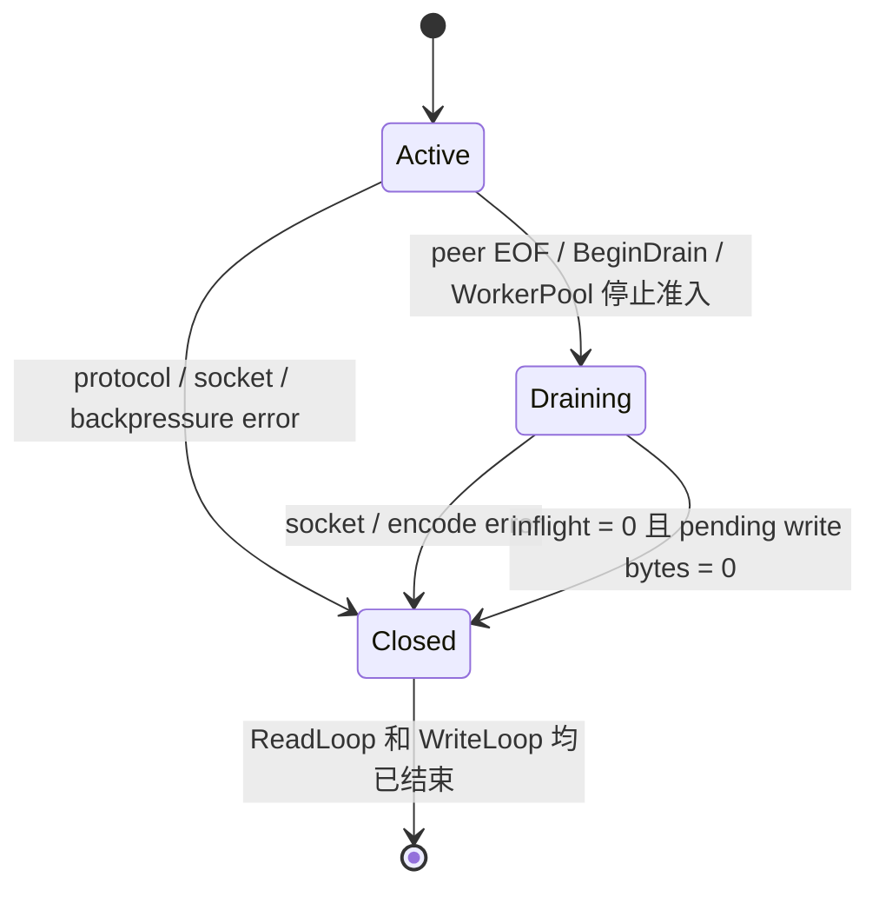
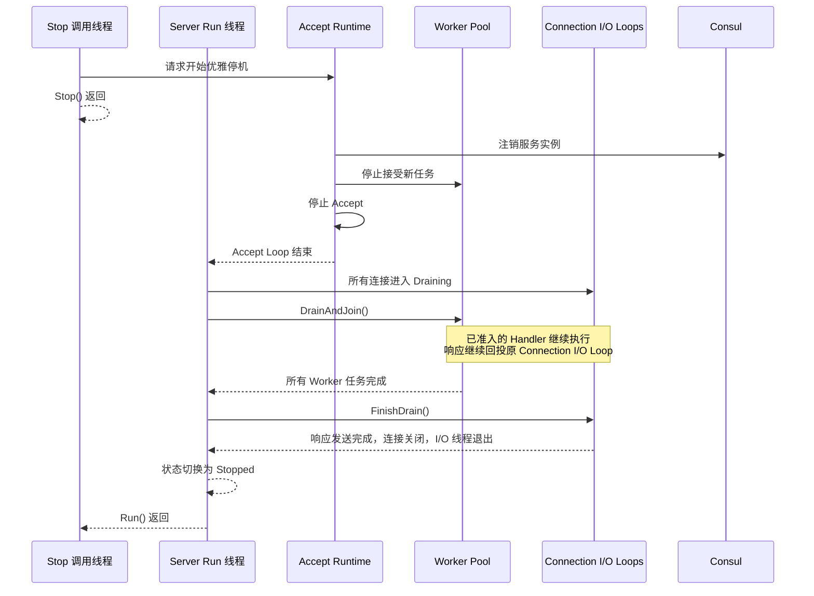

# 服务端运行时

xRPC 服务端把监听、连接 I/O 和业务执行分到不同线程，并通过明确的交接点组成一条有界的 RPC 执行路径。本篇关注这些组件如何组合、请求如何流动以及服务端如何关闭；协程和 `io_uring` 的底层机制见 [I/O 运行时](io-runtime.md)。

## 总体结构

`RpcServer` 是公开接口，`RpcServer::Impl` 负责组装内部组件并协调生命周期：

```text
RpcServer
└─ RpcServer::Impl
   ├─ ServerConfig
   ├─ ServiceRegistry
   ├─ WorkerPool
   ├─ ConsulRegistrar（可选）
   ├─ listen socket
   ├─ accept UringContext
   ├─ AcceptLoop Task
   └─ ConnectionIoLoop[]
      ├─ connection UringContext
      ├─ I/O thread
      ├─ DispatchMailbox
      └─ ServerConnection[]
         ├─ ReadLoop Task
         └─ WriteLoop Task
```

服务端运行在三类线程上：

| 执行线程 | 主要职责 |
| --- | --- |
| Server Run 线程 | 驱动 Accept `UringContext`，接收连接并协调服务端关闭 |
| Connection I/O 线程 | 管理所属连接的 socket I/O、帧解析、写队列和连接状态 |
| Worker 线程 | 查找服务方法、解析用户 Protobuf、执行 Handler 并编码响应 |

`RpcServer::Impl` 只负责组合和协调，不参与每次 RPC 的数据处理。连接的网络状态归属于 Connection I/O 线程，用户 Handler 则不会在 I/O 线程执行。

## 启动与连接建立

服务端生命周期为：

```text
Created → Listening → Running → Stopping → Stopped
```

正常启动过程如下：



`Listen()` 不启动 AcceptLoop，也不发布 Consul 服务，因此在 `Listen()` 之后、`Run()` 之前仍可注册方法。`Run()` 开始后，Registry 不再修改，Worker 可以在 dispatch 热路径只读访问它。

### 连接分配与线程归属

AcceptLoop 只负责接收新 socket。每个 socket 随后被分配给一个 `ConnectionIoLoop`，由对应 I/O 线程负责创建和管理连接：

```text
Server Run 线程
  │
  └─ AcceptLoop 得到 client socket
         │
         ├─ round-robin 选择一个 ConnectionIoLoop
         └─ PostStartConnection(socket)
                       │
          ─────── 跨线程交接 ───────
                       │
                       ▼
Connection I/O 线程
  │
  ├─ 创建 ServerConnection(socket)
  ├─ 保存到本线程的 connections_
  └─ 启动 ReadLoop 和 WriteLoop
```

`PostStartConnection()` 完成连接从 Server Run 线程到 Connection I/O 线程的唯一一次交接。此后 socket I/O 和连接可变状态都限制在该线程中，连接不会迁移到其他 I/O loop。

## 一次 RPC 的执行路径

一次请求跨越 Connection I/O 和 Worker 两个执行域，最终回到原 I/O 线程：



这里有两个关键线程边界：

- `WorkerPool::TrySubmitBatch()` 把 CPU 和业务工作从 I/O 线程交给 Worker；
- `DispatchMailbox` 把编码后的响应交回产生请求的 Connection I/O 线程。

Worker 不直接访问 socket，也不修改连接状态。每个 `ConnectionIoLoop` 拥有自己的 mailbox，因此 completion 会回到正确的 I/O 域。

一次 `FeedBytes()` 解出的 request batch 采用 all-or-nothing 准入：整批满足单连接 inflight 上限时才提交给 WorkerPool，否则整批返回 `ResourceExhausted`。WorkerPool 再以 batch 中的逻辑 RPC 数检查全局容量。

Worker 可以把同一 batch 的多个 Response frame 合并后回投；WriteLoop 也会合并写队列中相邻 frame，但单次发送 batch 不超过 64 KiB。合并只减少提交和发送次数，不改变线协议中的 frame 边界。

## 连接状态机

`ServerConnection::State` 表示连接当前所处的生命周期阶段，只包含 `Active`、`Draining` 和 `Closed`：



状态直接决定连接允许进行的工作：

| 状态 | 读取新请求 | 提交新 RPC | 处理已准入请求的响应 | 发送响应 |
| --- | --- | --- | --- | --- |
| `Active` | 是 | 是 | 是 | 是 |
| `Draining` | 否 | 否 | 是 | 是 |
| `Closed` | 否 | 否 | 丢弃迟到的响应 | 否 |

每个连接固定拥有一条 `ReadLoop()` 和一条 `WriteLoop()`。ReadLoop 只在 `Active` 状态继续接收和提交请求；进入 `Draining` 后停止读取。WriteLoop 在 `Active` 和 `Draining` 状态都可以发送响应，直到连接进入 `Closed`。

`inflight_requests_`、`write_queue_` 和 `pending_write_bytes_` 记录连接当前尚未完成的请求和响应，不构成新的生命周期阶段。其中 inflight 和 pending write bytes 共同决定 drain 是否完成：

```text
state == Draining
&& inflight_requests_ == 0
&& pending_write_bytes_ == 0
→ Closed
```

进入 `Closed` 时，连接取消 pending socket I/O、关闭 fd，并唤醒可能正在等待写队列的 WriteLoop。对象释放还需要满足更强的条件：

```text
state == Closed
&& ReadLoop Task 已结束
&& WriteLoop Task 已结束
→ ConnectionIoLoop 可以释放 ServerConnection
```

两条协程及连接的全部可变状态都限制在所属 Connection I/O 线程中。Worker 只能通过 `DispatchMailbox` 返回 completion，因此连接字段不需要跨 Worker 加锁。

## 资源边界

服务端使用三个独立上限约束不同资源：

| 上限 | 所有者 | 保护的资源 | 过载行为 |
| --- | --- | --- | --- |
| `max_inflight_per_connection` | `ServerConnection` | 单连接已接收但尚未完成的 RPC | 整批返回 `ResourceExhausted` |
| `max_pending_jobs_global` | `WorkerPool` | 全局已准入的逻辑 RPC | 返回 `ResourceExhausted` |
| `max_write_queue_bytes_per_connection` | `ServerConnection` | 慢客户端积压的响应字节 | 关闭对应连接 |

这三个限制不能互相替代。尤其是 Worker completion 到达后，RPC 已从 inflight 中释放，但响应仍可能因客户端读取缓慢而停留在写队列，因此写队列必须拥有独立的字节上限。

## Graceful shutdown

`Stop()` 线程安全且幂等，只负责发起停止；正在执行 `Run()` 的线程负责完成关闭并最终发布 `Stopped`：



关闭过程先从 Consul 注销实例，再停止本地 Worker 准入和 Accept。当前尚未在注销和本地截流之间等待服务发现传播，但这个顺序可以避免在本地已拒绝新工作后才主动注销。Worker Pool 排空期间，Connection I/O Loops 和 `DispatchMailbox` 必须继续运行，确保已准入请求能够完成响应编码、回投和发送。

如果 Handler 永远不返回，graceful shutdown 会一直等待；当前没有 shutdown timeout 或强制关闭机制。`Run()` 发生异常时也会执行同一套组件清理，再将失败返回给调用者。

在 `Created` 或 `Listening` 状态调用 `Stop()` 时，没有运行中的 AcceptLoop 或连接需要排空，服务端可以直接清理资源并进入 `Stopped`；之后调用 `Run()` 会失败。

## Consul 实例注册与健康检查

启用服务注册后，`Run()` 通过配置的 Consul Agent 注册整个服务实例，而不是逐个注册 RPC method。假设 Echo 服务监听在 `10.0.0.12:9000`，注册请求的 JSON 类似：

```json
{
  "Name": "echo-service",
  "ID": "echo-service-10.0.0.12-9000",
  "Address": "10.0.0.12",
  "Port": 9000,
  "Check": {
    "Name": "xRPC TCP health check",
    "TCP": "10.0.0.12:9000",
    "Interval": "5s",
    "Timeout": "1s"
  }
}
```

注册完成后不需要 xRPC 定期续租或发送心跳。Consul Agent 每 5 秒尝试连接一次服务端口，单次连接最多等待 1 秒；检查失败时实例会变为非健康状态，并从客户端使用的 `passing=true` 查询结果中消失。该机制只验证 TCP 端口是否可以建立连接，不执行一次真实 RPC。

正常关闭时，服务端主动按实例 ID 注销。进程异常退出时无法主动注销，实例仍可能保留在 Consul Catalog 中，但健康检查失败后不会继续作为健康 Endpoint 提供给客户端。

客户端如何感知健康实例变化并更新路由，见 [客户端运行时](client-runtime.md#consul-变化如何到达客户端)。
